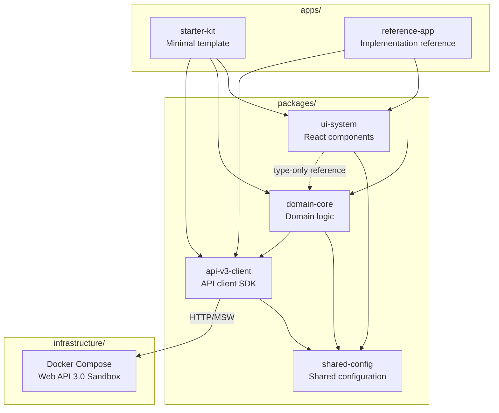
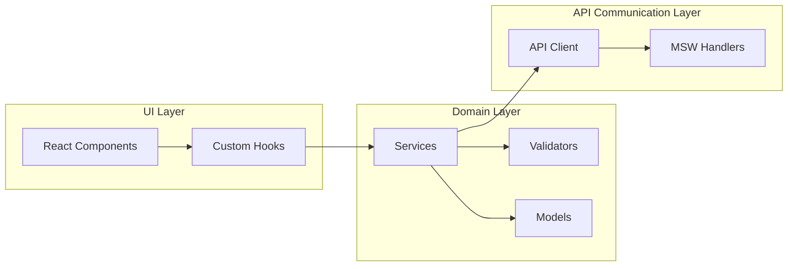
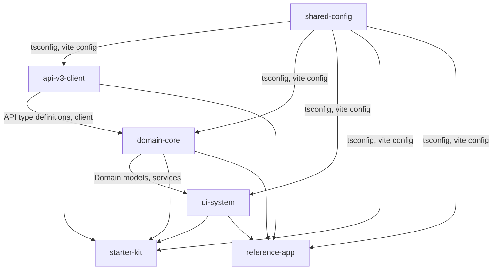
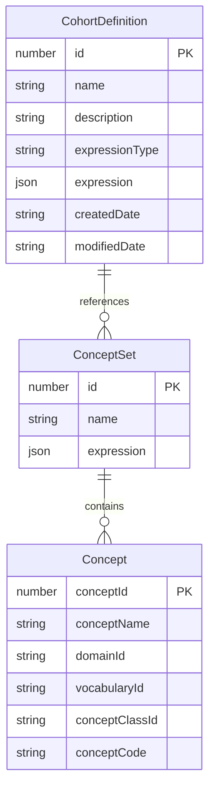

# Design Document: Atlas V3 Hackathon Boilerplate

## Overview

This design document defines the technical design for a hackathon boilerplate leveraging OHDSI Atlas Web API 3.0.
It uses an npm workspaces monorepo structure to achieve a 3-layer separation architecture of UI / Domain Logic / API Communication.

Key design goals:
- A concise setup that allows hackathon participants to start development within 5 minutes
- Embodies best practices of the Atlas V3 architecture (3-layer separation)
- Development experience without an API server via MSW mock mode
- Instant availability of a Web API 3.0 Sandbox via Docker

Technology stack:
- Package management: npm workspaces
- Build tool: Vite
- Framework: React 18+
- Language: TypeScript 5+
- Mocking: MSW (Mock Service Worker)
- Containers: Docker Compose

## Architecture

### Overall Structure



### 3-Layer Separation Architecture

Based on Atlas V3 design principles, the following 3 layers are clearly separated within each application:



**Design decision rationale:**
- The UI layer depends on React, but the Domain and API layers are implemented in pure TypeScript, making them framework-independent
- The Domain layer uses the API client, and the UI layer accesses data through the Domain layer (unidirectional dependency: UI → Domain → API)
- MSW intercepts requests at the browser's Service Worker level, enabling mock/production switching without application code changes


### Package Dependencies



**Build order:**
1. `shared-config` (no dependencies)
2. `api-v3-client` (depends on shared-config)
3. `domain-core` (depends on shared-config, api-v3-client)
4. `ui-system` (depends on shared-config, domain-core types)
5. `starter-kit` / `reference-app` (depends on all packages)

## Components and Interfaces

### 1. shared-config Package

```
packages/shared-config/
├── package.json
├── tsconfig.base.json        # TypeScript base configuration
├── tsconfig.react.json       # React TypeScript configuration
├── vite.config.base.ts       # Vite base build configuration
├── vite.config.lib.ts        # Library build Vite configuration
└── index.ts                  # Export entry
```

**Provided interfaces:**


```typescript
// tsconfig.base.json key settings
{
  "compilerOptions": {
    "target": "ES2022",
    "module": "ESNext",
    "moduleResolution": "bundler",
    "strict": true,
    "esModuleInterop": true,
    "skipLibCheck": true,
    "declaration": true,
    "declarationMap": true,
    "sourceMap": true,
    "outDir": "./dist",
    "rootDir": "./src"
  }
}

// vite.config.base.ts
import { defineConfig } from 'vite';

export function createBaseConfig(options?: { react?: boolean }) {
  return defineConfig({
    build: {
      target: 'es2022',
      sourcemap: true,
    },
    resolve: {
      dedupe: ['react', 'react-dom'],
    },
  });
}
```

### 2. api-v3-client Package

```
packages/api-v3-client/
├── package.json
├── tsconfig.json
├── vite.config.ts
├── src/
│   ├── index.ts              # Public API exports
│   ├── client.ts             # API client class
│   ├── types/
│   │   ├── index.ts
│   │   ├── cohort.ts         # Cohort-related type definitions
│   │   ├── concept.ts        # Concept-related type definitions
│   │   └── common.ts         # Common type definitions (ApiError, PaginatedResponse, etc.)
│   ├── endpoints/
│   │   ├── cohort.ts         # Cohort API endpoints
│   │   └── concept.ts        # Concept API endpoints
│   └── errors.ts             # Error handling
└── __tests__/
```

**Key interfaces:**

```typescript
// client.ts
export interface ApiClientConfig {
  baseUrl: string;
  authToken?: string;
  timeout?: number;
}

export class AtlasApiClient {
  constructor(config: ApiClientConfig);
  cohort: CohortEndpoints;
  concept: ConceptEndpoints;
}

// endpoints/cohort.ts
export interface CohortEndpoints {
  getAll(): Promise<CohortDefinition[]>;
  getById(id: number): Promise<CohortDefinition>;
  create(definition: CreateCohortRequest): Promise<CohortDefinition>;
  update(id: number, definition: UpdateCohortRequest): Promise<CohortDefinition>;
  delete(id: number): Promise<void>;
}

// errors.ts
export class ApiError extends Error {
  constructor(
    public readonly status: number,
    public readonly code: string,
    message: string,
    public readonly details?: unknown
  );
}
```

### 3. domain-core Package

```
packages/domain-core/
├── package.json
├── tsconfig.json
├── vite.config.ts
├── src/
│   ├── index.ts              # Public API exports
│   ├── models/
│   │   ├── cohort.ts         # Cohort domain model
│   │   └── concept-set.ts    # ConceptSet domain model
│   ├── services/
│   │   ├── cohort-service.ts # Cohort business logic
│   │   └── concept-service.ts
│   ├── validators/
│   │   ├── cohort-validator.ts
│   │   └── concept-validator.ts
│   └── serializers/
│       └── cohort-serializer.ts  # JSON serialization/deserialization
└── __tests__/
```

**Key interfaces:**

```typescript
// models/cohort.ts
export interface CohortDefinition {
  id: number;
  name: string;
  description: string;
  expressionType: string;
  expression: CohortExpression;
  createdDate: string;
  modifiedDate: string;
}

export interface CohortExpression {
  Type: string;
  CriteriaList: CriteriaGroup[];
  DemographicCriteriaList: DemographicCriteria[];
  Groups: ExpressionGroup[];
}

// services/cohort-service.ts
export interface CohortService {
  list(): Promise<CohortDefinition[]>;
  get(id: number): Promise<CohortDefinition>;
  create(input: CreateCohortInput): Promise<CohortDefinition>;
  update(id: number, input: UpdateCohortInput): Promise<CohortDefinition>;
  remove(id: number): Promise<void>;
  validate(definition: CohortDefinition): ValidationResult;
}

// validators/cohort-validator.ts
export interface ValidationResult {
  valid: boolean;
  errors: ValidationError[];
}

export interface ValidationError {
  field: string;
  message: string;
  code: string;
}

// serializers/cohort-serializer.ts
export interface Serializer<T> {
  serialize(model: T): string;
  deserialize(json: string): T;
}
```

### 4. ui-system Package

```
packages/ui-system/
├── package.json
├── tsconfig.json
├── vite.config.ts
├── src/
│   ├── index.ts              # Public API exports
│   ├── components/
│   │   ├── Button.tsx
│   │   ├── DataTable.tsx
│   │   ├── Form.tsx
│   │   └── Layout.tsx
│   ├── theme/
│   │   ├── theme.ts          # Theme definition
│   │   ├── ThemeProvider.tsx  # Theme provider
│   │   └── tokens.ts         # Design tokens
│   └── hooks/
│       └── useTheme.ts
└── __tests__/
```

**Key interfaces:**

```typescript
// theme/theme.ts
export interface AtlasTheme {
  colors: {
    primary: string;
    secondary: string;
    background: string;
    surface: string;
    error: string;
    text: { primary: string; secondary: string };
  };
  spacing: (factor: number) => string;
  typography: {
    fontFamily: string;
    fontSize: Record<string, string>;
  };
}

// theme/ThemeProvider.tsx
export interface ThemeProviderProps {
  theme?: Partial<AtlasTheme>;
  children: React.ReactNode;
}

// components/DataTable.tsx
export interface DataTableProps<T> {
  data: T[];
  columns: ColumnDefinition<T>[];
  onRowClick?: (row: T) => void;
  loading?: boolean;
}
```

### 5. starter-kit Application

```
apps/starter-kit/
├── package.json
├── tsconfig.json
├── vite.config.ts
├── index.html
├── public/
│   └── mockServiceWorker.js  # MSW Service Worker
├── src/
│   ├── main.tsx              # Entry point
│   ├── App.tsx
│   ├── mocks/
│   │   ├── browser.ts        # MSW browser setup
│   │   └── handlers.ts       # MSW request handlers
│   ├── features/
│   │   └── cohort/
│   │       ├── CohortList.tsx
│   │       ├── useCohort.ts  # Custom Hook (bridge to Domain layer)
│   │       └── index.ts
│   └── config.ts             # Environment configuration
└── __tests__/
```

**MSW mock mode design:**

```typescript
// src/mocks/browser.ts
import { setupWorker } from 'msw/browser';
import { handlers } from './handlers';

export const worker = setupWorker(...handlers);

// src/mocks/handlers.ts
import { http, HttpResponse } from 'msw';

export const handlers = [
  http.get('/api/v3/cohortdefinition', () => {
    return HttpResponse.json([/* mock data */]);
  }),
  // ... other endpoints
];

// src/main.tsx
async function bootstrap() {
  if (import.meta.env.VITE_MOCK_MODE === 'true') {
    const { worker } = await import('./mocks/browser');
    await worker.start({ onUnhandledRequest: 'bypass' });
  }
  // Start React application
}
```

### 6. reference-app Application

```
apps/reference-app/
├── package.json
├── tsconfig.json
├── vite.config.ts
├── index.html
├── src/
│   ├── main.tsx
│   ├── App.tsx
│   ├── mocks/                # MSW (same as starter-kit)
│   ├── features/
│   │   ├── cohort/
│   │   │   ├── CohortListPage.tsx
│   │   │   ├── CohortDetailPage.tsx
│   │   │   ├── CohortFormPage.tsx
│   │   │   └── useCohort.ts
│   │   └── concept/
│   │       ├── ConceptSearchPage.tsx
│   │       └── useConcept.ts
│   └── router.tsx            # Routing configuration
└── __tests__/
```

### 7. Infrastructure

```
infrastructure/
├── docker-compose.yml
├── .env.example
└── README.md
```

**Docker Compose design:**

```yaml
# docker-compose.yml
version: '3.8'
services:
  webapi:
    image: ohdsi/webapi:latest
    ports:
      - "8080:8080"
    environment:
      - DATASOURCE_URL=jdbc:postgresql://db:5432/ohdsi
      - DATASOURCE_USERNAME=ohdsi
      - DATASOURCE_PASSWORD=ohdsi
    depends_on:
      - db

  db:
    image: postgres:15
    ports:
      - "5432:5432"
    environment:
      - POSTGRES_USER=ohdsi
      - POSTGRES_PASSWORD=ohdsi
      - POSTGRES_DB=ohdsi
    volumes:
      - pgdata:/var/lib/postgresql/data

volumes:
  pgdata:
```

### 8. Root package.json Script Design

```json
{
  "name": "atlas-v3-hackathon",
  "private": true,
  "workspaces": ["packages/*", "apps/*"],
  "scripts": {
    "dev": "npm run --workspaces --if-present dev",
    "dev:mock": "VITE_MOCK_MODE=true npm run --workspaces --if-present dev",
    "build": "npm run build:packages && npm run build:apps",
    "build:packages": "npm run -w packages/shared-config build && npm run -w packages/api-v3-client build && npm run -w packages/domain-core build && npm run -w packages/ui-system build",
    "build:apps": "npm run --workspaces --if-present build:app",
    "test": "npm run --workspaces --if-present test",
    "clean": "npm run --workspaces --if-present clean"
  }
}
```


## Data Models

### Atlas Web API 3.0 Key Entities



### TypeScript Type Definitions

```typescript
// api-v3-client/src/types/cohort.ts
export interface CohortDefinition {
  id: number;
  name: string;
  description: string;
  expressionType: string;
  expression: CohortExpression;
  createdDate: string;
  modifiedDate: string;
}

export interface CohortExpression {
  Type: string;
  CriteriaList: CriteriaGroup[];
  DemographicCriteriaList: DemographicCriteria[];
  Groups: ExpressionGroup[];
}

export interface CriteriaGroup {
  Criteria: Criterion[];
  Type: string;
  Count?: number;
}

export interface Criterion {
  ConditionOccurrence?: ConditionOccurrence;
  DrugExposure?: DrugExposure;
}

export interface CreateCohortRequest {
  name: string;
  description?: string;
  expressionType: string;
  expression: CohortExpression;
}

export type UpdateCohortRequest = Partial<CreateCohortRequest>;

// api-v3-client/src/types/concept.ts
export interface Concept {
  conceptId: number;
  conceptName: string;
  domainId: string;
  vocabularyId: string;
  conceptClassId: string;
  conceptCode: string;
  standardConcept?: string;
  invalidReason?: string;
}

export interface ConceptSet {
  id: number;
  name: string;
  expression: ConceptSetExpression;
}

export interface ConceptSetExpression {
  items: ConceptSetItem[];
}

export interface ConceptSetItem {
  concept: Concept;
  isExcluded: boolean;
  includeDescendants: boolean;
  includeMapped: boolean;
}

// api-v3-client/src/types/common.ts
export interface ApiResponse<T> {
  data: T;
  status: number;
}

export interface PaginatedResponse<T> {
  content: T[];
  totalElements: number;
  totalPages: number;
  page: number;
  size: number;
}

export interface ApiErrorResponse {
  status: number;
  code: string;
  message: string;
  details?: unknown;
}
```

### Domain Models and Validation

```typescript
// domain-core/src/validators/cohort-validator.ts
export interface ValidationRule<T> {
  field: keyof T | string;
  validate: (value: unknown, model: T) => boolean;
  message: string;
  code: string;
}

export const cohortValidationRules: ValidationRule<CohortDefinition>[] = [
  {
    field: 'name',
    validate: (value) => typeof value === 'string' && value.trim().length > 0,
    message: 'Cohort name is required',
    code: 'REQUIRED_NAME',
  },
  {
    field: 'name',
    validate: (value) => typeof value === 'string' && value.length <= 255,
    message: 'Cohort name must be 255 characters or fewer',
    code: 'NAME_TOO_LONG',
  },
  {
    field: 'expressionType',
    validate: (value) => ['SIMPLE_EXPRESSION', 'CUSTOM'].includes(value as string),
    message: 'Invalid expressionType',
    code: 'INVALID_EXPRESSION_TYPE',
  },
];
```

### Serialization

```typescript
// domain-core/src/serializers/cohort-serializer.ts
export class CohortSerializer implements Serializer<CohortDefinition> {
  serialize(model: CohortDefinition): string {
    return JSON.stringify({
      id: model.id,
      name: model.name,
      description: model.description,
      expressionType: model.expressionType,
      expression: model.expression,
      createdDate: model.createdDate,
      modifiedDate: model.modifiedDate,
    });
  }

  deserialize(json: string): CohortDefinition {
    const parsed = JSON.parse(json);
    // Deserialization with validation
    if (!parsed.id || !parsed.name) {
      throw new Error('Invalid CohortDefinition JSON');
    }
    return parsed as CohortDefinition;
  }
}
```


## Correctness Properties

*A property is a characteristic or behavior that should hold true across all valid executions of the system. It is a formal description that bridges human-readable specifications and machine-verifiable correctness guarantees.*

### Property 1: Workspace Package Reference Integrity

For *any* workspace package, dependencies on other workspace packages must be declared using the `workspace:*` protocol, and the corresponding TypeScript path resolution (tsconfig paths or references) must be correctly configured.

**Validates: Requirements 1.3, 11.3**

### Property 2: Shared TypeScript Config Inheritance

For *any* workspace package (excluding shared-config itself), its tsconfig.json must extend shared-config's tsconfig.base.json (or tsconfig.react.json).

**Validates: Requirements 2.1**

### Property 3: API Client Config Preservation

For *any* valid ApiClientConfig (combination of baseUrl, authToken, timeout), when AtlasApiClient is initialized, the client's configuration must match the input.

**Validates: Requirements 3.1**

### Property 4: Unified API Error Handling

For *any* HTTP error status code (4xx, 5xx), the API client must return an ApiError-typed error with status, code, and message fields properly set.

**Validates: Requirements 3.3**

### Property 5: Cohort Validation Correctness

For *any* CohortDefinition, validation rules must be correctly applied. Specifically: if name is an empty string or whitespace only, return invalid; if it exceeds 255 characters, return invalid; if the value is valid, return valid.

**Validates: Requirements 4.2**

### Property 6: Domain Model Serialization Round-Trip

For *any* valid CohortDefinition, the result of serializing and then deserializing must be equivalent to the original object.

**Validates: Requirements 4.3**

### Property 7: Consistent Theme Configuration Reflection

For *any* AtlasTheme configuration, the theme values provided through ThemeProvider must match the values obtained via the useTheme hook in child components.

**Validates: Requirements 5.3**

## Error Handling

### API Communication Errors

| Error Type | HTTP Status | Handling Strategy |
|---|---|---|
| Authentication error | 401 | Throw ApiError, redirect to auth flow at call site |
| Authorization error | 403 | Throw ApiError, notify user of insufficient permissions |
| Resource not found | 404 | Throw ApiError, display appropriate message in UI |
| Validation error | 400 | Throw ApiError, include field errors in details |
| Server error | 5xx | Throw ApiError, retry if retryable |
| Network error | - | Throw NetworkError, notify offline state |
| Timeout | - | Throw TimeoutError, configurable timeout value |

### Error Handling Hierarchy

```typescript
// API layer: unified error transformation
class AtlasApiClient {
  private async request<T>(url: string, options?: RequestInit): Promise<T> {
    try {
      const response = await fetch(url, options);
      if (!response.ok) {
        const body = await response.json().catch(() => ({}));
        throw new ApiError(response.status, body.code ?? 'UNKNOWN', body.message ?? response.statusText, body.details);
      }
      return response.json();
    } catch (error) {
      if (error instanceof ApiError) throw error;
      if (error instanceof TypeError) throw new NetworkError('Network request failed');
      throw error;
    }
  }
}

// Domain layer: business logic errors
class CohortServiceImpl implements CohortService {
  validate(definition: CohortDefinition): ValidationResult {
    const errors: ValidationError[] = [];
    for (const rule of cohortValidationRules) {
      if (!rule.validate(definition[rule.field as keyof CohortDefinition], definition)) {
        errors.push({ field: rule.field, message: rule.message, code: rule.code });
      }
    }
    return { valid: errors.length === 0, errors };
  }
}

// UI layer: user-facing error display
function useCohort() {
  const [error, setError] = useState<string | null>(null);

  const handleError = (err: unknown) => {
    if (err instanceof ApiError) {
      setError(`API error: ${err.message}`);
    } else if (err instanceof NetworkError) {
      setError('Please check your network connection');
    } else {
      setError('An unexpected error occurred');
    }
  };
}
```

### Error Simulation in MSW Mock Mode

```typescript
// mocks/handlers.ts - error case mocks
export const errorHandlers = [
  http.get('/api/v3/cohortdefinition/999', () => {
    return HttpResponse.json(
      { code: 'NOT_FOUND', message: 'Cohort not found' },
      { status: 404 }
    );
  }),
  http.post('/api/v3/cohortdefinition', async ({ request }) => {
    const body = await request.json();
    if (!body.name) {
      return HttpResponse.json(
        { code: 'VALIDATION_ERROR', message: 'Name is required', details: { field: 'name' } },
        { status: 400 }
      );
    }
    // Normal response
    return HttpResponse.json({ id: 1, ...body }, { status: 201 });
  }),
];
```

## Testing Strategy

### Dual Testing Approach

This project adopts both unit tests and property-based tests.

**Unit tests:**
- Verification of specific example cases, edge cases, and error conditions
- Verification of integration points (inter-package coordination)
- Verification of MSW mock mode behavior

**Property-based tests:**
- Verification of properties that should universally hold for all inputs
- Comprehensive coverage through randomly generated inputs

### Test Framework

- Test runner: Vitest
- Property-based testing: fast-check
- React component testing: @testing-library/react
- MSW: msw (setupServer for test environment)

### Property-Based Test Configuration

- Each property test runs a minimum of 100 iterations
- Each test includes a comment referencing the property number from the design document
- Tag format: **Feature: atlas-v3-hackathon-boilerplate, Property {number}: {property_text}**
- Each correctness property is implemented as a single property-based test

### Test Targets and Placement

| Package | Unit Tests | Property Tests |
|---|---|---|
| shared-config | Config file structure verification | Property 1, 2 |
| api-v3-client | MSW integration tests, endpoint calls | Property 3, 4 |
| domain-core | Validation examples, service logic | Property 5, 6 |
| ui-system | Component rendering, accessibility | Property 7 |
| starter-kit | MSW mock mode behavior verification | - |
| reference-app | CRUD operation integration tests | - |

### Property Test Implementation Example

```typescript
import { describe, it, expect } from 'vitest';
import { fc } from '@fast-check/vitest';
import { CohortSerializer } from '../src/serializers/cohort-serializer';

// Feature: atlas-v3-hackathon-boilerplate, Property 6: Domain Model Serialization Round-Trip
describe('CohortSerializer', () => {
  const serializer = new CohortSerializer();

  it.prop(
    [fc.record({
      id: fc.nat(),
      name: fc.string({ minLength: 1 }),
      description: fc.string(),
      expressionType: fc.constantFrom('SIMPLE_EXPRESSION', 'CUSTOM'),
      expression: fc.record({
        Type: fc.string(),
        CriteriaList: fc.array(fc.anything()),
        DemographicCriteriaList: fc.array(fc.anything()),
        Groups: fc.array(fc.anything()),
      }),
      createdDate: fc.date().map(d => d.toISOString()),
      modifiedDate: fc.date().map(d => d.toISOString()),
    })],
    { numRuns: 100 }
  )('serialize then deserialize produces equivalent object', (cohort) => {
    const serialized = serializer.serialize(cohort);
    const deserialized = serializer.deserialize(serialized);
    expect(deserialized).toEqual(cohort);
  });
});
```

### Unit Test Implementation Example

```typescript
import { describe, it, expect } from 'vitest';
import { validateCohort } from '../src/validators/cohort-validator';

describe('CohortValidator', () => {
  it('should reject cohort with empty name', () => {
    const result = validateCohort({ name: '', expressionType: 'SIMPLE_EXPRESSION' });
    expect(result.valid).toBe(false);
    expect(result.errors).toContainEqual(
      expect.objectContaining({ code: 'REQUIRED_NAME' })
    );
  });

  it('should accept valid cohort definition', () => {
    const result = validateCohort({
      name: 'Test Cohort',
      expressionType: 'SIMPLE_EXPRESSION',
      expression: { Type: 'ALL', CriteriaList: [], DemographicCriteriaList: [], Groups: [] },
    });
    expect(result.valid).toBe(true);
  });
});
```
